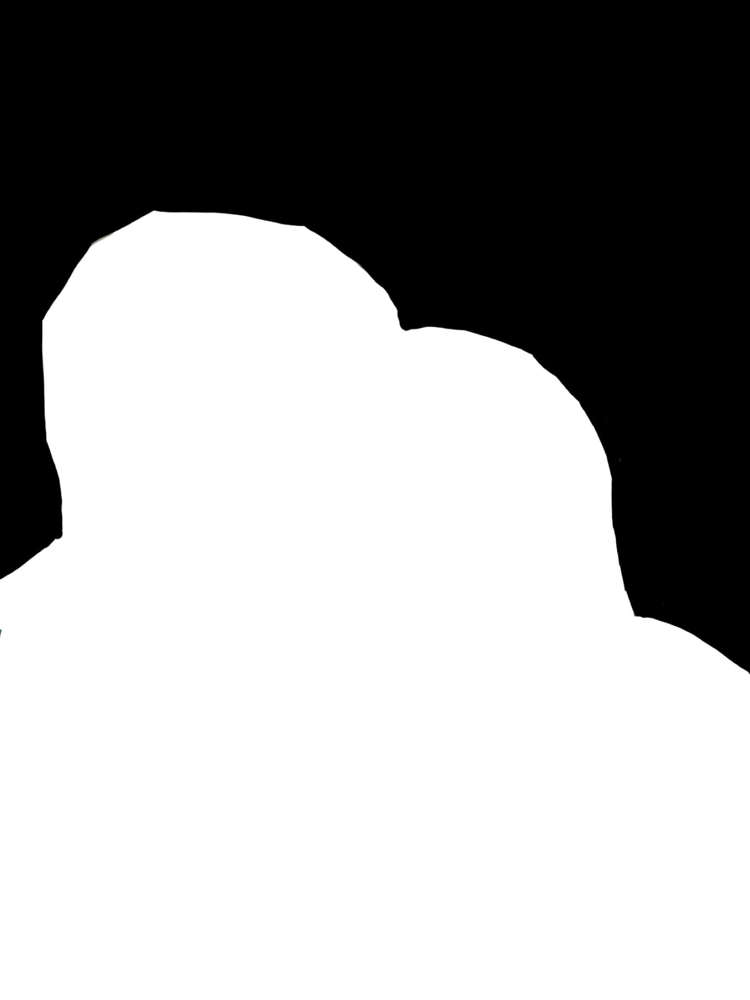
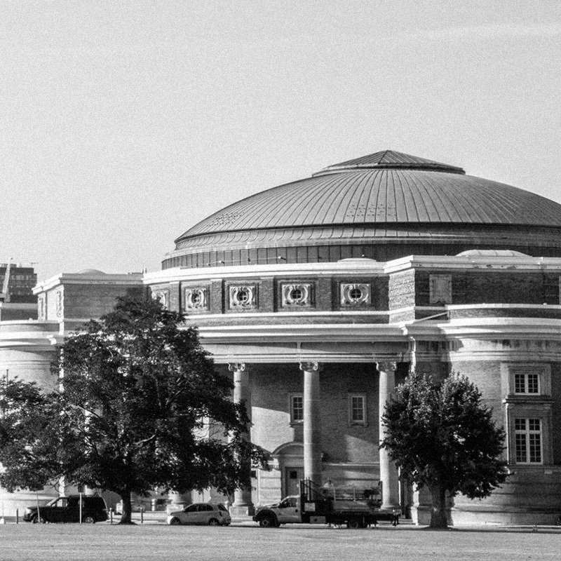
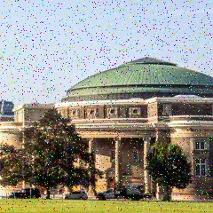
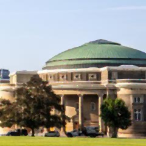
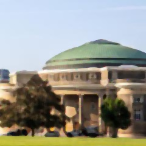

### CSC420 Assignment 1

###### Q1

a) Computational cost of computing $h * I$ if $h$ is not separable is $n \times n \times m \times m = (nm)^2$.

b) Computational cost if $h$ is separable: $2mn^2$.

######Q2

Canny edge detection:

1. Filter image with derivation of Gaussian to locate the edge. Apply the derivation of Gaussian filter directly onto the image with convolution operation.

2. Compute magnitude and direction of gradient at each point for further detection.
   Compute magnitude of the gradient by: 
   $$
   |\nabla f(x,y)|=\sqrt{\bigg(\frac{\part f}{\part x}(x,y)\bigg)^2+\bigg(\frac{\part f}{\part y}(x,y)\bigg)^2}.
   $$
   Compute direction of the gradient by: 
   $$
   \theta(x,y)=\tan^{-1}\bigg(\frac{\part f}{\part y}(x,y)/\frac{\part f}{\part x}(x,y)\bigg).
   $$
   Or using any other method to compute orientation and classify with some possible angles (e.g assign these directions into 0, 45, 90, 135).

3. Non- maximum suppression: By checking if the pixel has the local maximum magnitude along the gradient direction (direction that perpendicular to the edge) and keep the maximum to locate the most obvious point in such direction to keep the edge into a single pixel curve.
   After compution the magnitude and orientation of the gradient, for the point with same orientation compare magnitude and keep the maximum.

4. Linking and thresholding: Applying a higher threshold to keep only the edge pixels with large magnitude value and  get rid of any "weaker" edges or any error detection. However, edges might be discontinuous because of the high threshold. Then apply a lower threshold to find any other edge points to connect "strong edges" together and avoid any missing pieces.

###### Q3

Image gradient could be used for edge detection by detecting the rapid changes in image intensity (rapid change will give us a gradient with larger gradient  magnitude). But applying the first derivative of gaussian will give us a thick edge if threshold is applied. Applying second derivative will find the maximum point of first derivative of gaussian which is also the middle point of the rapid change inside the image (point across x-axis of the second derivative). However, since images could have noise and noise has a huge impact on gradient and laplacian, we could apply a Gaussian filter firstly to smooth the image and denoise then apply any filter for differentiation. This is same as applying laplacian of gaussian filter directly onto the image because of the associative property of convolution. Therefore, laplacian of Gaussian filter could be used on image to detect a better edge.

###### Q4

##### Functions see file a1q4.py.

a) 
Test Image:


Result for mode 'valid':          Result for mode 'same':         Result for mode 'full':     

    

b)
Test Image same as a).

Result for mode 'valid':          Result for mode 'same':         Result for mode 'full':        

c)
Function to_portrait_mode takes two parameters, image target and mask to notify background and foreground object. The filter I used to blur background is gaussian filter with $\sigma = 20$ and size $10\times10$ since larger filter gaussian with a larger $\sigma$ value will gives a better blur image which is more similar to the image that is out of focus.

Target image:                                                   Mask image:

   

Output image:


###### Q5

a) 
A separable filter is the filter that could be computed by matrix multiplication of two vectors. That is filter $T = P * Q^T$ where $T$ is a column vector and $Q$ is a row vector.

b)

#####Functions see file a1q5.py.

Test case1:
with smoothing filter: 
$$
\frac{1}{16} \left[ {\begin{array}{cc}
   1 & 2 & 1\\
   2 & 4 & 2\\
   1 & 2 & 1\\
  \end{array} } \right]
$$
Output:

```
[-0.25 -0.5  -0.25]
[-0.25 -0.5  -0.25]

[[ 0.0625  0.125   0.0625]
 [ 0.125   0.25    0.125 ]
 [ 0.0625  0.125   0.0625]]
True
```

Test case1:
with any random filter: 
$$
\left[ {\begin{array}{cc}   1 & 2 & 3\\   4 & 5 & 6\\   7 & 8 & 9\\  \end{array} } \right]
$$
Output:

```
False
```

######Q6

#####Functions see file a1q6.py.

a)
Image with uniform random noise with magnitude $m=0.05$:



b)
The filter I used to blur background is gaussian smoothing filter with $\sigma = 5$ and size $5\times5$ to blur the image to denoise. For image with random uniform noise, each pixel value will be added a uniform random noise value. And since the noise is in a uniform distribution with $\text{mean} = \frac12(-m + m) = 0$. Therefore, by applying smoothing filter to compute the average of the pixels inside each small patch could remove the noise and get a smooth image.

Image:


c)
Image with salt and pepper noise with density $d=0.05$:


d)

Gaussian filter does not work for salt and pepper noise. Since salt and pepper noise is not distributed uniformly, the mean of these noise inside each patch might not be zero. 

Denoise with median filter by finding the median value of several pixels. Since salt and pepper noise are some pixels with extreme value like 0 or 255, these pixels are hard to be the median of several pixels. So by applying median filter, these 'bad' pixels will be filtered out and be replaced by some value of other pixels.

Apply gaussian filter in b) onto the image with salt and pepper noise:


Apply median filter with size $3\times3$ onto the image with salt and pepper noise:


e)

Add salt and pepper noise onto a color image:



Apply median filter with size $3\times3$ onto each color channel of the image with salt and pepper will give us:



Apply median filter with size $5 \times5$ onto the image with salt and pepper will give us:



The result image with median filter (by finding median value inside a list of pixel values) size $3\times3$ still have some noise blocks inside since it consider fewer pixels values to find the median for each pixel. With a larger median filter size (e.g. size $5\times 5$), the image will have less information but also have less noise block by considering more pixel values for each new pixel value.